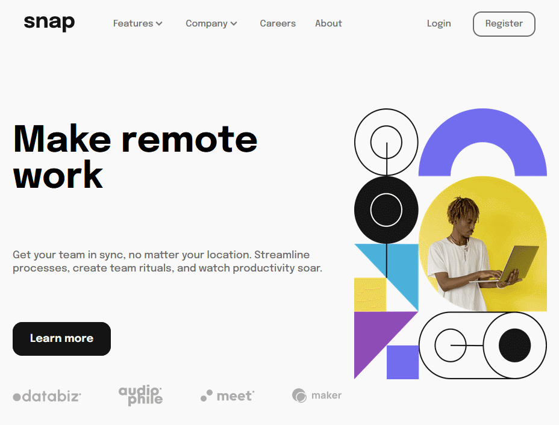
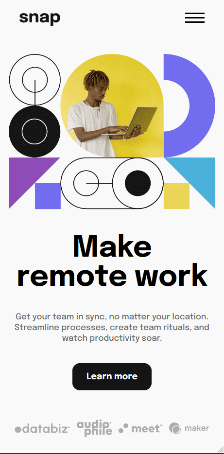

# 💻 Personal Portfolio

<h1 align="center">
  
<h1>

Essa é a solução do desafio [Intro section with dropdown navigation](https://www.frontendmentor.io/challenges/intro-section-with-dropdown-navigation-ryaPetHE5/hub/intro-section-with-dropdown-navigation-VlFD8ZUKMZ).

##  🧵 Índice

  - [Screenshot](#📷-screenshot)
  - [Links](#🖇-links)
  - [How to Contribute](#♻-how-to-contribute)
  - [Built With](#🛠-built-with)
  - [What I've learned](#📝-what-ive-learned)
  - [Autor](#🙋🏻‍♂️-autor) 

### 📷 Screenshots
<div style="display:flex">
  
  
</div>


### 🖇 Links

- [URL do desafio](https://www.frontendmentor.io/challenges/intro-section-with-dropdown-navigation-ryaPetHE5/hub/intro-section-with-dropdown-navigation-VlFD8ZUKMZ)
- [URL Solução](https://monsor3s.github.io/intro-section/)

## ♻ How to Contribute
```bash
  # Clone the project
  $ git clone https://github.com/monsor3s/intro-section.git
```
```bash
  # Enter directory
  $ cd intro-section
```

### 🛠 Built With

- [Flexbox](https://developer.mozilla.org/pt-BR/docs/Learn/CSS/CSS_layout/Flexbox)
- [Design Responsivo](https://developer.mozilla.org/pt-BR/docs/Learn/CSS/CSS_layout/Responsive_Design)
- [RSCSS](https://medium.com/stantmob/rscss-styling-your-css-without-losing-your-sanity-36bca30520f1) - For styles
- [JavaScript Vanilla](https://developer.mozilla.org/en-US/docs/Web/javascript)


### 📝 What I've learned

- More learning with responsive design.
- Use of CSS methodology for styling styles with better maintenance.
- Dropdown menu enhancement

##  🙋🏻‍♂️ Autor

- Linkedln - [@Linkedln](https://www.linkedin.com/in/marlon-monsores-380408b2/)
- Frontend Mentor - [@monsor3s](https://www.frontendmentor.io/profile/monsor3s)


